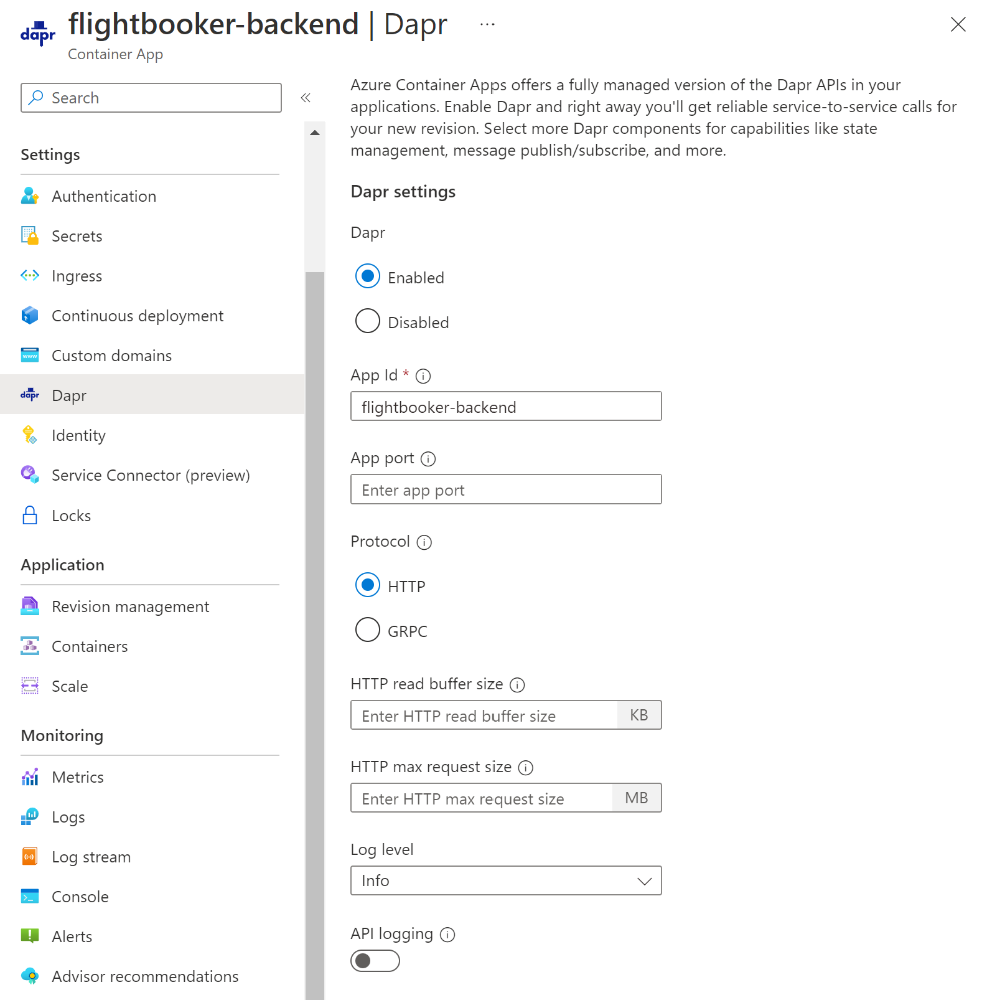

# Challenge 2: Deploy Microservices to Azure Container App

Duration: 20 minutes

[Previous Challenge Solution](01-Build-and-push-locally-solution.md) - **[Home](../README.md)** - [Next Challenge Solution](03-GitHub-Actions-solution.md)

## Task 1: Create Container Apps for each microservice with the images from the ACR

You can create a container app with the Azure portal or with the Azure CLI.

For the backend your CLI code should look something like this:

```
az containerapp create `
  --name flightbooker-backend `
  --resource-group $RESOURCE_GROUP `
  --environment $CONTAINERAPPS_ENVIRONMENT `
  --registry-server "$ACR_NAME.azurecr.io"`
  --image "$ACR_NAME.azurecr.io/flightbookerbackend:latest"`
  --target-port 3000`
  --ingress 'internal' `
  --query properties.configruation.ingress.fqdn
```

If you want to check if the backend is working properly you can also for now set the ingress to 'external' and change it later on.
When the deployment of the backend is finished you will receive an application URL (FQDN) visible on the overview page of your new container app. If ingress is set to external you can open it with '/api/seats' appended and you will see the an array with the seats like this:


Before you can deploy the frontend you need to take some additional steps since the frontend needs to be able to access the backend. Copy the FQDN of your backend Container App. In VS Code create a .env file in the flightbooker-frontend folder. There you create two environment variables:

```
VITE_DAPR_HOST='YOUR_BACKEND_FQDN'
VITE_DAPR_HTTP_PORT='443'
```

This will connect the variables in the BookingService.js with your environment variables and instead of the localhost the frontend will access the backend container app.

Now you can begin to deploy the frontend:

```
az containerapp create `
  --name flightbooker-frontend `
  --resource-group $RESOURCE_GROUP`
  --environment $CONTAINERAPPS_ENVIRONMENT`
  --image "$ACR_NAME.azurecr.io/flightbookerfrontend:latest"`
  --registry-server "$ACR_NAME.azurecr.io"`
  --env-vars VITE_DAPR_HOST=https://$(az containerapp show --resource-group $RESOURCE_GROUP --name flightbooker-backend --query properties.configuration.ingress.fqdn -o tsv) VITE_DAPR_HTTP_PORT=443`
  --target-port 5173`
  --ingress 'external' `
  --query properties.configruation.ingress.fqdn
```

Instead of the query in the VITE_DAPR_HOST you can also again just copy and paste your backend FQDN.

In this case we want to have just one replica available so go to the <b>Scale</b> section und the <b>Application</b> tag in your newly deployed frontend and change the scale to 0-1.

To deploy the apps with the portal, take a look [here](https://learn.microsoft.com/en-us/azure/container-apps/get-started-existing-container-image-portal?pivots=container-apps-private-registry).

For a method using a service principal and key vault, you can find a solution [here](https://learn.microsoft.com/en-us/azure/container-instances/container-instances-using-azure-container-registry).

After deployment you can copy the Application URL (FQDN) of the frontend container app and open it in your browser and you should be able to browse the frontend web app.

## Task 2: Setup basic Security

If you set up the backend ingress to "internal", it won't be reachable from the public internet but only from applications deployed within your Azure Container Environment.
If you set it to external first you can change it under the <b>Ingress</b> tab in your backend container app to disable external ingress.


## Task 3: Activate dapr in your Container Apps

So far dapr was not enabled on the Azure Container Apps we provisioned. You can check this in the Portal and it should look something like this:

<br>
To enable dapr for both Apps, run the following commands:

```
az containerapp dapr enable --name "flightbooker-backend" `
  --resource-group $RESOURCE_GROUP`
  --dapr-app-id "flightbooker-backend"`
  --dapr-app-port 443

az containerapp dapr enable --name "flightbooker-frontend" `
  --resource-group $RESOURCE_GROUP`
  --dapr-app-id "flightbooker-frontend" `
  --dapr-app-port 5173
```

Or you can just enable it in the portal:



For more dapr configurations look [here](https://learn.microsoft.com/en-us/azure/container-apps/dapr-overview?tabs=bicep1%2Cyaml).
With this you should be able to access the Frontend Web App and call the backend API app using dapr. This is a [Service-to-Service invocation](https://learn.microsoft.com/en-us/azure/container-apps/microservices-dapr-service-invoke?pivots=nodejs).

## Next Challenge

Challenge 3: [Deploy Microservices to Azure Container App via GitHub Actions](../Challenges/03-GitHub-Actions.md)
