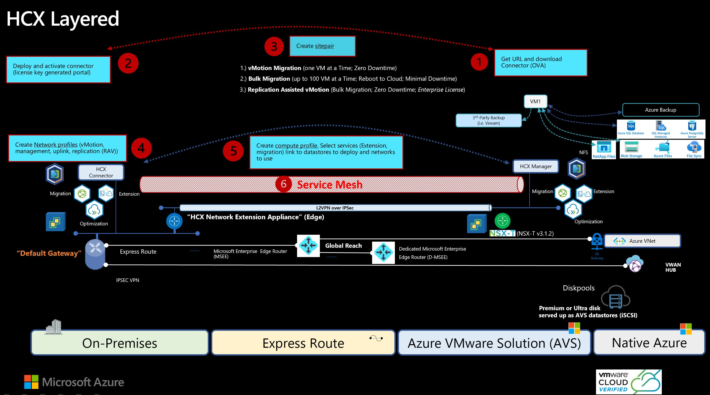

# HCX Manager Appliance

[Previous Challenge](./04-NSX-Firewall.md) - **[Home](../Readme.md)** - [Next Challenge](./06-HCX-Site-Pair.md)

## Introduction

1. Customer migration is often driven by a need to move a known set of existing applications to a new infrastructure. The most common use case for HCX is migration from On-Prem to Azure VMware Service (AVS).
2. Customer wants to realize value faster for new AVS environments while driving down operational costs.
3. Due to time constraint choosing HCX proves to be beneficial as parallel migration scenarions like bulk migrations as well as live non-disruptive migrations to and from On-Prem to AVS.

## HCX Deployment view 

## Challenge 

In this challenge, you will perform the following tasks:

1.	Configure HCX Manager Appliance On-Prem

As a part of this challenge you are also expected to <u>log on to the On Prem and AVS vCenter servers from the jumpbox assigned to your user</u>. You will also be expected to log on to the AVS portal to retrieve the HCX activation key for On-Prem HCX appliance.

Please carefully follow the instructions provided by your facilitator. Incorrectly deploying the HCX may result in multiple forthcoming steps not operating as expected.

Work with the instructor to ensure your VMware environment has the required permissions to access your AVS vCenter Server.

### Note

The HCX Manager VM within the On Prem vCenter server was deployed through an OVA (appliance) that we downloaded from AVS HCX. This step was done during the environment preparation to save time.

You can ask your coach to show you how this step was done

## Success Criteria

You can login to the HCX Manager UI and see the HCX Manager Appliance is up and running.

## Learning resources

### Solution - Spoilerwarning

[Solution Steps](../Solutionguide/05-HCX-Manager-Appliance.md)