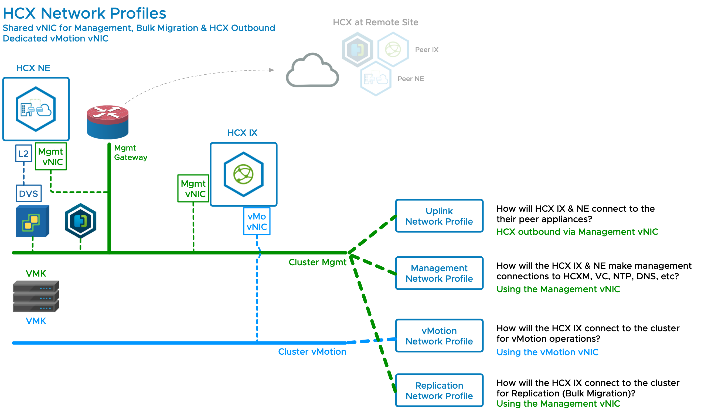

# HCX Network Profiles

[Previous Challenge](./06-HCX-Site-Pair.md) - **[Home](../Readme.md)** - [Next Challenge](./08-HCX-Compute-Profiles.md)

## Introduction

1. Network Profiles can be pre-created in the Network Profile tab or they can be created during the Compute Profile configuration. A Network Profile contains:

2. One underlying vSphere Port Group (VSS or VDS) or NSX-based network.

3. IP address information: The gateway IP, the network prefix and MTU, and DNS.

4. A pool of IP addresses reserved for HCX to use during Service Mesh deployments.

## Characteristics of Network Profiles

1. Network Profile configurations are only used during Service Mesh deployments (IP addresses assigned to the IX and NE, and OSAM appliances).

2. The HCX Manager only uses a Management interface, it does not use other Network Profile networks.

3. A Compute Profile will always include one or more Network Profile.

4. When Service Mesh is deployed, every Network Profile that is included in the Compute Profile configuration is used.

5. When a Network Profile network is used in a Service Mesh, the HCX appliance will consume a single IP address out of the configured IP pool.

6. When a Network Profile is assigned to a specific HCX traffic type (the traffic types are explained in the next section), a single IP address is used. For example, if the same Network Profile is assigned for HCX Management and HCX Uplink, one IP address is used, not two.

7. A Network Profile can be used with multiple Compute Profiles.

### Example network profile in a customer environment

## Challenge 

In this challenge, you will perform the following tasks:

1.	Create Network Profile

As a part of this challenge you are also expected to <u>log on to the On Prem vCenter server and go to HCX Manager plugin on the vCenter</u> to configure the Network Profile

Please carefully follow the instructions provided by your facilitator. Incorrectly deploying the HCX may result in multiple forthcoming steps not operating as expected.

Work with the instructor to ensure your VMware environment has the required permissions to access your AVS vCenter Server.

## Success Criteria

The created network profiles will be avaiable to be used by Interconnect and Network Enxtension appliances within the Service Mesh.

## Learning resources

### Solution - Spoilerwarning

[Solution Steps](../Solutionguide/07-HCX-Network-Profiles.md)