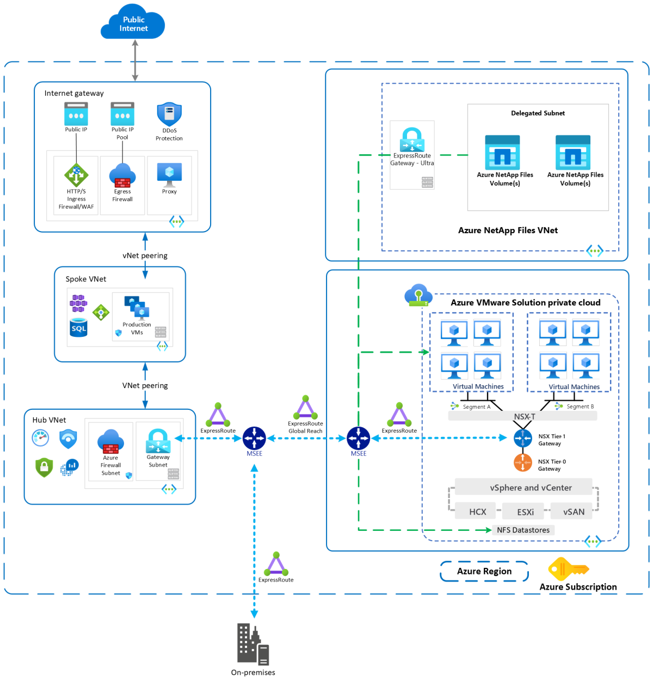

# AVS ANF Datastores

[Previous Challenge](./11-AVS-Migrate-VM.md) - **[Home](../Readme.md)** - [Next Challenge](./13-AVS-Storage-Policy.md)

## Introduction

Azure NetApp Files is an enterprise-class, high-performance, metered file storage service. The service supports the most demanding enterprise file-workloads in the cloud: databases, SAP, and high-performance computing applications, with no code changes. For more information on Azure NetApp Files, see Azure NetApp Files documentation.

Azure VMware Solution supports attaching Network File System (NFS) datastores as a persistent storage option. You can create NFS datastores with Azure NetApp Files volumes and attach them to clusters of your choice. You can also create virtual machines (VMs) for optimal cost and performance.

By using NFS datastores backed by Azure NetApp Files, you can expand your storage instead of scaling the clusters. You can also use Azure NetApp Files volumes to replicate data from on-premises or primary VMware environments for the secondary site.

## Challenge 

Create your Azure VMware Solution and create Azure NetApp Files NFS volumes in the virtual network connected to it using an ExpressRoute. Ensure there's connectivity from the private cloud to the NFS volumes created. Use those volumes to create NFS datastores and attach the datastores to clusters of your choice in a private cloud. As a native integration, no other permissions configured via vSphere are needed.

The following diagram demonstrates a typical architecture of Azure NetApp Files backed NFS datastores attached to an Azure VMware Solution private cloud via ExpressRoute.

 

## Success Criteria

## Learning resources