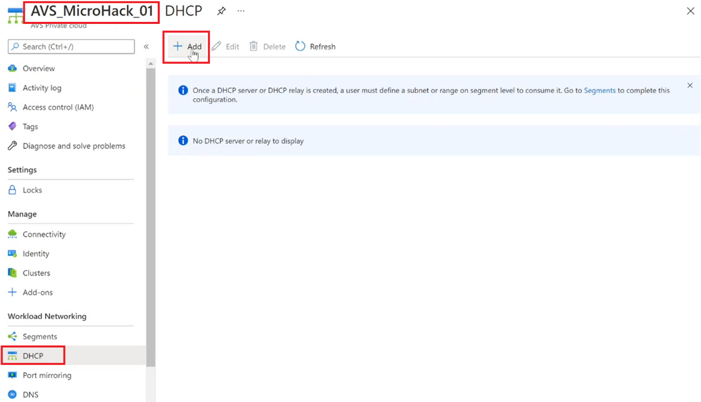
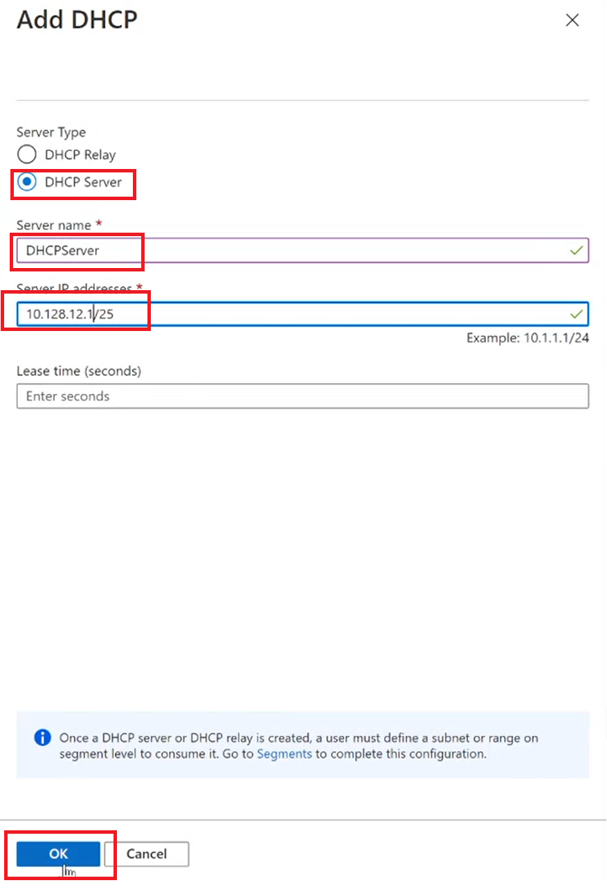
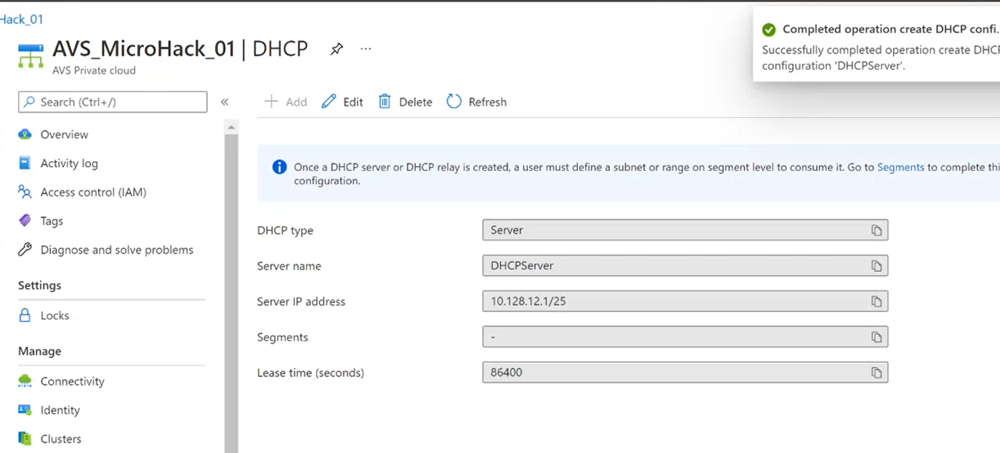
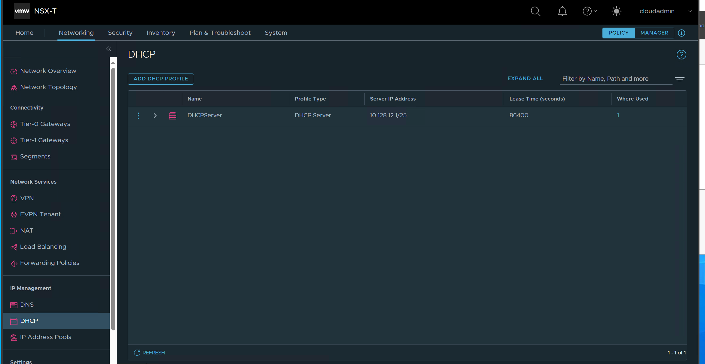

# Exercise 1: Create a NSX-T DHCP Server

**[Home](../Readme.md)** - [Next Challenge Solution](./02-NSX-Add-Segment.md)

## Instructions

Here you will be using NSX-T to host your DHCP server and you will create a DHCP. Then you'll add a network segment and specify the DHCP IP address range.
### Create a DHCP server
1.	In the Azure VMware Solution portal, go to Workload Networking > DHCP and then select Add.

1.	Select DHCP for the Server Type, provide the server name and IP address CIDR, and then select OK.
 

 
2.	Once done, the DHCP server will be listed in the DHCP tab 
 

### Note
This DHCP server automatically gets connected to the default Tier 1 Gateway

3.	You can now log on to NSX Manager in AVS and verify that the DHCP server is attached to the Tier1 Gateway

