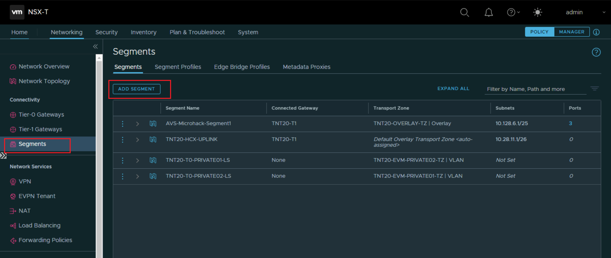
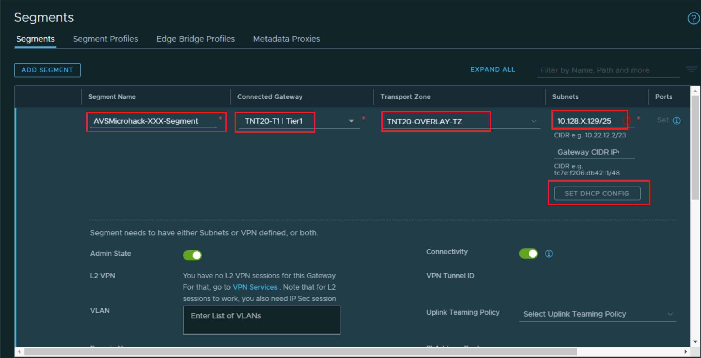

# Exercise 2: Add a NSX-T Segment

[Previous Challenge Solution](./01-NSX-DHCP.md) - **[Home](../Readme.md)** - [Next Challenge Solution](./03-NSX-Add-DNS-Forwarder.md)

## Add a Network Segment
1.	In NSX-T Manager, select Networking > Segments, and then select Add Segment.

 
2.	Enter a name for the segment.

3.	Select the Tier-1 Gateway (TNTxx-T1) as the Connected Gateway 

4.	Select the pre-configured overlay Transport Zone (TNTxx-OVERLAY-TZ) and then select Set Subnets in gateway/prefix length format.

5. Add DHCP range to your segment such that the VM's attached to this segment can recieve IP address dynamically

6.	Select Apply and then Save.

### Note
The IP address needs to be on a non-overlapping RFC1918 address block, which ensures connection to the VMs on the new segment.

7. Create a VM from the ISO file in the Content Library (SERVER_EVAL_x64FRE_en-us.iso) and attach it to the segment you just created.
8. Power on the VM and verify that it has received an IP address from the DHCP server.

### Hint

The segment needs to attach to the virtual machine by right clicking the VM > Edit Settings > Network Adaptor 1 
