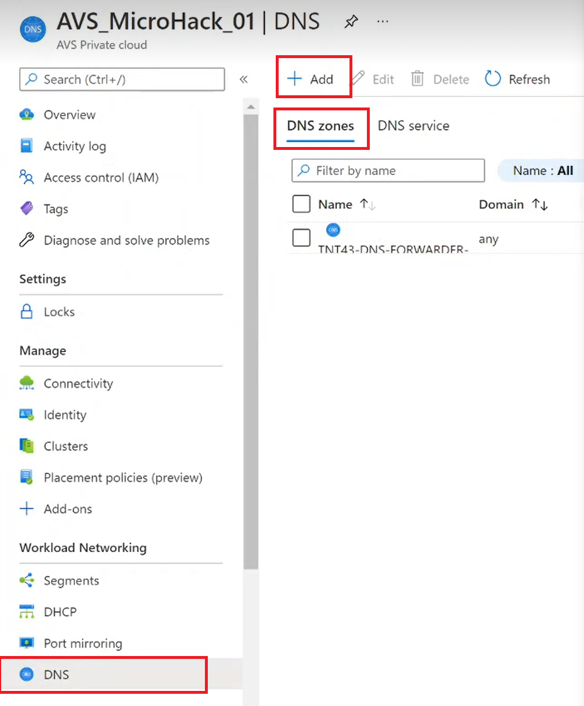
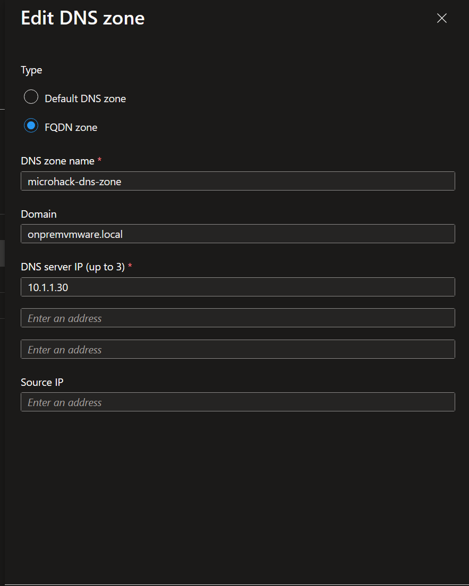
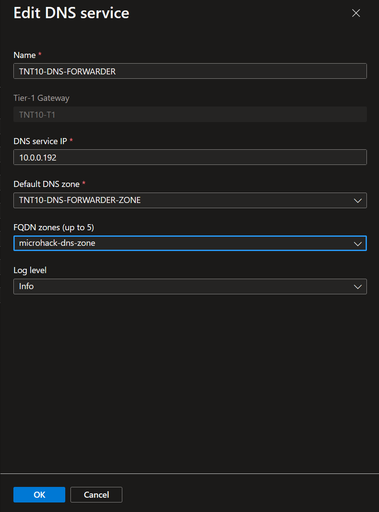

# Exercise 3: Lets explore NSX - So we need to add a DNS Forwarder

[Previous Challenge Solution](./02-NSX-Add-Segment.md) - **[Home](../Readme.md)** - [Next Challenge Solution](./04-HCX-Manager-Appliance.md)

## Configure a DNS forwarder

1.  In your Azure VMware Solution private cloud, under Workload Networking, select DNS > DNS zones. Then select Add.

2.  Add the On-Prem FQDN zone by inputting details regarding the DNS Zone Name, Domain Name and DNS Seever IP from the Credentials&IP document and press save 

3.  Attach the configured DNS Zone name to Default DNS Zone and press save

4.  For this Microhack there was also a nested VMware cluster deployed which is running inside the AVS cluster. This nested cluster is reachable from the Jumbox-VM under https://10.1.1.2/ and the credentials are availble in the provided Azure Key Vault.

5. In the on-premise VMware clusters there are two VMs running. One is a Windows 2022 Domain Controller and the other is a domain-joined Windows 2022 server. 

6. Find the hostname of the domain-joined server.

7. Verify from the VM created in last challenge that it can resolve the hostname of the domain-joined on-prem server.

### Note : 

These DNS zones are a prerequisite for LDAP configuration for NSX. 